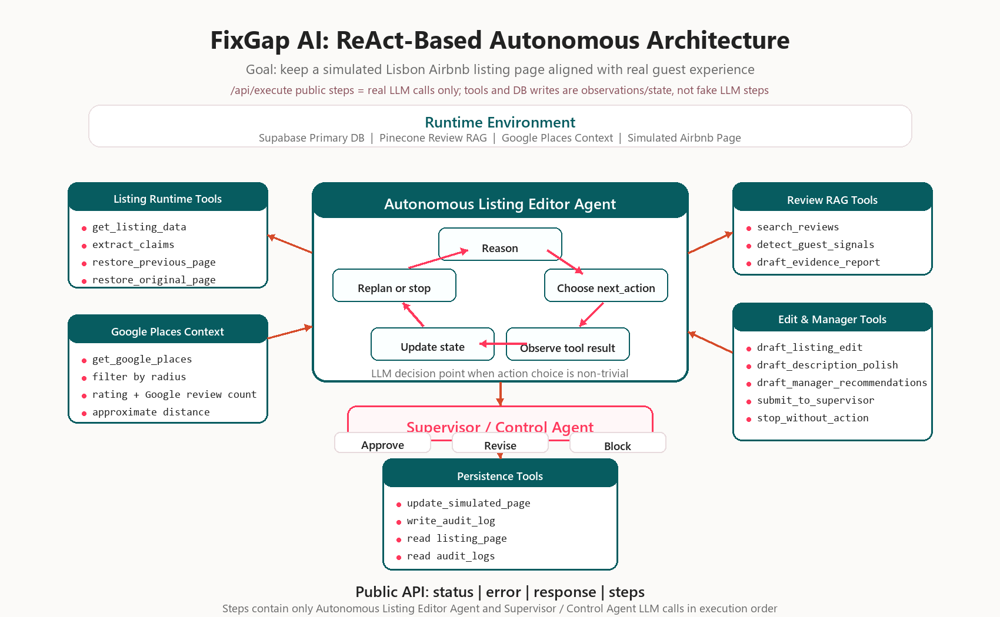

<p align="center">
  
  
  
  
  
  
  
  
</p>

# FixGap AI

**Autonomous Lisbon Airbnb Listing Editor**

FixGap AI is an autonomous AI agent that keeps simulated short-term-rental listing pages aligned with real guest experience. It helps a Lisbon property manager detect gaps between the current listing page, Airbnb guest reviews, and nearby Google Places context, then safely update only the allowed simulated listing-page text.

The system does not access a live Airbnb account, scrape websites, change prices, answer private guest messages, or edit guest reviews. Approved updates are written only to the demo listing page and are recorded in Supabase audit logs.

Supabase is the primary runtime database. Approved simulated listing-page updates and audit logs persist in Supabase, so refreshing the app does not inherently remove an approved update. The explicit `Reset Page` demo control restores listing state when needed.

## How It Works

The main agent follows a ReAct-style loop:

```text
Reason -> Choose Tool -> Observe -> Update State -> Replan or Stop
```

`Autonomous Listing Editor Agent` receives a property-manager request, chooses relevant tools dynamically, observes evidence, updates its state, and decides whether to draft an edit, ask for more evidence, stop without action, or submit a proposal.

`Supervisor / Control Agent` reviews proposed page updates before execution. It can approve, revise, or block an action, so the agent can complete end-to-end tasks while keeping edits narrow, evidence-backed, and inside the simulated page boundary.

## Architecture



## Data & Evidence

- **50 final Lisbon listings** selected for richer Airbnb review coverage and nearby-place context.
- **Airbnb guest reviews** are the primary evidence source and are retrieved through Pinecone RAG.
- **Google Places** provides supporting environmental context such as nearby place names, ratings, review counts, categories, and approximate distance.
- **Listing page state and audit logs** persist in Supabase during production runtime.

## Production Stack

Production runs with live LLMod.ai decision calls for the Agent and Supervisor modules.

| Layer | Technology |
| --- | --- |
| Application | Next.js / TypeScript |
| Text model | `MB5R2CF-azure/gpt-5.4-mini` |
| LLM provider | LLMod.ai |
| Embeddings | `MB5R2CF-azure/text-embedding-3-small` |
| Primary database | Supabase |
| Vector database | Pinecone |
| Deployment | Vercel |

## Required Project API

```text
GET  /api/team_info
GET  /api/agent_info
GET  /api/model_architecture
POST /api/execute
```

`POST /api/execute` accepts:

```json
{
  "prompt": "User request here"
}
```

Success response:

```json
{
  "status": "ok",
  "error": null,
  "response": "...",
  "steps": []
}
```

Error response:

```json
{
  "status": "error",
  "error": "Human-readable error description",
  "response": null,
  "steps": []
}
```

`steps` contains the real LLM calls executed by the agent in order, as required by the course API specification. Each step includes the module name, the effective prompt sent to the model, and the parsed model response.

## Safety & Scope

- No live Airbnb account access.
- No scraping or live guest-review ingestion.
- No price, booking, availability, or payment changes.
- No private-message or review-response automation.
- No editing of source CSV rows, guest reviews, Google Places source rows, or booking data.
- No unsupported facts, amenities, or claims.
- Updates occur only in the simulated demo listing page.

## Local Development

```bash
npm install
npm run dev
```

Local development supports an optional mock LLM mode for testing without external model calls.

## Team

| Name | Email |
| --- | --- |
| Shoval Zvieli | shovalzvieli@campus.technion.ac.il |
| Daniel Elhadif-Kaminer | edaniel@campus.technion.ac.il |
| Opal Zvieli | opalzvieli@campus.technion.ac.il |
